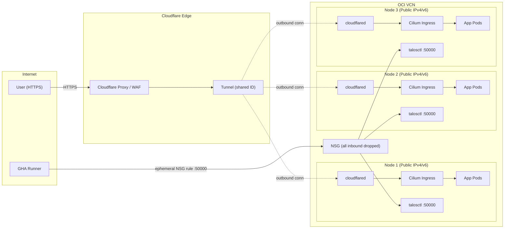

# Architecture Design: Automated K8s on OCI (A1 Free Tier)

## ## 1. Infrastructure Provisioning (HCP Terraform)

### **Execution Model**

* **VCS-Driven Workflow:** GitHub Actions does **not** manually trigger `terraform apply`. The repository is linked directly to **HCP Terraform**. Commits to the `main` branch automatically trigger a **Plan and Apply** within the HCP environment.
* **Authentication:** **OIDC (OpenID Connect)** is used between GitHub and HCP Terraform. No long-lived API tokens or static credentials are stored in GitHub.
* **Formatters & Linters:** `tflint` and `terraform fmt` are enforced in GitHub Actions via `mise` before the code reaches HCP Terraform.

### **Compute & OS (Talos Linux)**

* **Shape:** 3 x `VM.Standard.A1.Flex` (1 OCPU, 8GB RAM each).
* **Control Plane:** 3-node HA, **schedulable** (no taints).
* **Disk Strategy:** * **Boot Volume:** Used for both the OS and **Local Path Provisioner (LPP)**.
* **Data Risk:** No physical block volumes are attached. Data safety is guaranteed via **application-level replication** and **automated backups to OCI Object Storage**.

---

## ## 2. Data Persistence & Replication

### **PostgreSQL: CloudNativePG (CNPG)**

* **Operator:** [CloudNativePG](https://cloudnativepg.io/).
* **Strategy:** Native streaming replication across 3 nodes.
* **Backups:** Handled natively by the operator's `backup` resource to OCI Object Storage.

### **Redis: OT-Container-Kit Redis Operator**

* **Operator:** [Redis Operator](https://github.com/ot-container-kit/redis-operator).
* **Configuration:** Deploy as a **Redis Sentinel** or **Redis Cluster** (3 replicas).
* **Why Replicate?** Even as a cache, replication is required so that any node in the cluster can access the data. Since LPP is node-local, a single-instance Redis would lose its data if the pod reschedules to a different node.

### **MongoDB: MongoDB Community Operator**

* **Operator:** [MongoDB Community Kubernetes Operator](https://github.com/mongodb/mongodb-kubernetes-operator).
* **Configuration:** Deploy a 3-node **ReplicaSet**.
* **Data Sharing:** MongoDB handles the sync across the 3 LPP volumes on each node.

---

## ## 3. Connectivity & Edge Security

### **Cloudflare Tunnel Ingress (Replacing NLB)**

* **Architecture:** All HTTP/HTTPS ingress is handled via a **Cloudflare Tunnel**. A single tunnel ID is shared across all 3 nodes, with each node running a `cloudflared` connector as a Talos System Extension. Cloudflare automatically routes requests to the nearest healthy connector, providing built-in load balancing and failover.
* **No NLB / No CCM:** The OCI Network Load Balancer and OCI Cloud Controller Manager are **entirely eliminated**. This removes the need for Cloudflare IP allowlisting in NSGs, Proxy Protocol configuration, and the `X-Origin-Auth` header-based origin validation — the tunnel's outbound-only connection model inherently prevents origin-IP-spoofing attacks.
* **Tunnel Config:** The `cloudflared` extension is compiled into the Talos boot image via Image Factory. Each node's `ExtensionServiceConfig` launches `cloudflared` during early boot, connecting to the shared tunnel and proxying ingress traffic to the local Cilium Ingress endpoint.

### **Public IP Assignment & Lockdown**

* **Public IPv4/IPv6:** Each node is assigned a public IPv4 and IPv6 address.
* **NSG Policy:** The NSG **drops all inbound traffic by default**. No ports (80, 443, or otherwise) are opened for HTTP/HTTPS — all web traffic flows through the Cloudflare Tunnel's outbound connections.
* **Only Use:** The public IPs exist solely as targets for `talosctl` access (port 50000) from ephemeral GitHub Actions runners.

### **Talos API Access (Port 50000)**

* **Access Method:** Ephemeral GitHub Actions runners.
* **GHA Configuration:** The runner fetches its public IP, adds a temporary NSG rule allowing port 50000 from that IP, executes `talosctl`, then removes the rule.
* **Talosctl Setup:** `talosconfig` is generated in GHA using OIDC-protected secrets and a base template.

---

## ## 4. GitOps & Bootstrap Sequence

### **Layered CD Strategy**

* **Layer 0 (Base Layer - Flux CD):** Flux bootstraps the cluster. It manages "system-level" components: Cilium, Sealed Secrets, and Argo CD itself.
* **Layer 1 (App Layer - Argo CD):** Argo CD manages all end-user applications using **Helm**.
* **Argo CD + Helm:** Argo renders Helm charts internally. No manual YAML manifests are maintained for apps.
* **GUI Hardening:** All Web UI editing features are disabled.

### **The Bootstrap Workflow**

1. **HCP Terraform** provisions the VCN and Instances (with public IPs locked down).
2. **GHA** runs `talosctl apply-config` to initialize the OS (cloudflared starts as a system extension).
3. **GHA** runs `flux bootstrap` (The Base Layer).
4. **Flux** installs **Argo CD**, which then auto-syncs the Applications.

---

## ## 5. Networking (Cilium)

* **L3/L4/L7:** Cilium handles all layers. Standard `kube-proxy` is disabled.
* **Ingress:** Cilium Ingress Controller (receives traffic from local `cloudflared` connector).
* **No External LB:** Traffic enters via Cloudflare Tunnel → `cloudflared` → Cilium Ingress. Client IPs are preserved via `CF-Connecting-IP` / `X-Forwarded-For` headers injected by Cloudflare.

---

## ## 6. OCI IAM Policies (Auth)

Instances utilize **Instance Principals** via Dynamic Groups (no static keys).

* **Storage Policy:** `Allow dynamic-group K8sGroup to manage objects in compartment... where target.bucket.name='k8s-backups'`

> **Note:** The CCM load-balancer policy is no longer required since NLB has been replaced by Cloudflare Tunnels.

---

## ## 7. The "Real Apps" Stack

All apps use **OCI Object Storage** for high-volume assets to save LPP space.

| Application | Primary DB | Notes |
| --- | --- | --- |
| **Matrix (Tuwunel)** | PostgreSQL (CNPG) | Lightweight Rust-based homeserver. |
| **Vaultwarden** | PostgreSQL (CNPG) | Minimal RAM usage; Bitwarden API compatible. |
| **Docmost** | PostgreSQL (CNPG) | Documentation; uses Redis for caching. |

---

## ## 8. LPP Data Risk & Backup Strategy

* **Persistence:** LPP is node-local on the boot volume. Data is protected by 3-way application replication.
* **Backups:** Automated snapshots to **OCI Object Storage** via CronJobs or native Operator CRDs.
* **Secret Storage:** `kubeseal` private keys are stored in GitHub Secrets and injected via Flux during bootstrap so that the public repo's encrypted secrets remain valid.

---

## ## 9. Observability (Planned)

* **Status:** Not implemented (Resource preservation).
* **Stack:** Grafana Alloy, Loki, Mimir (backed by Object Storage).
